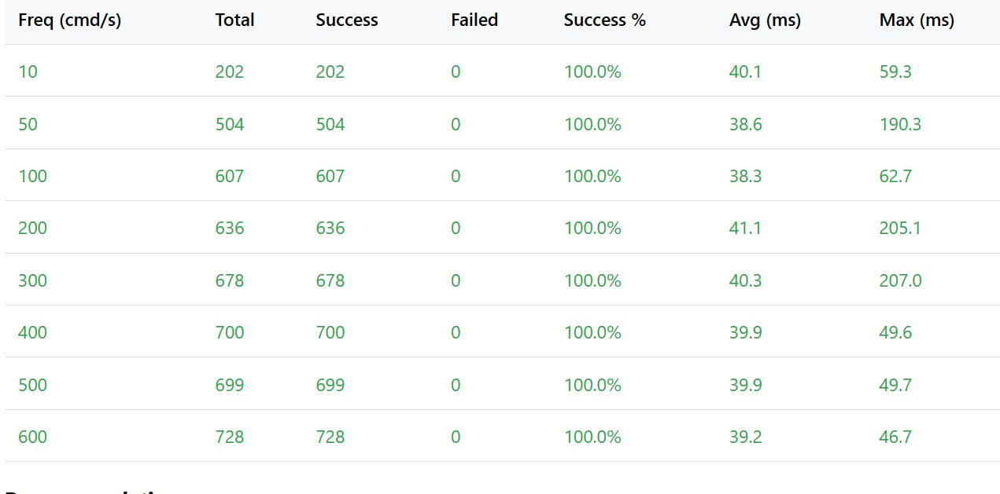
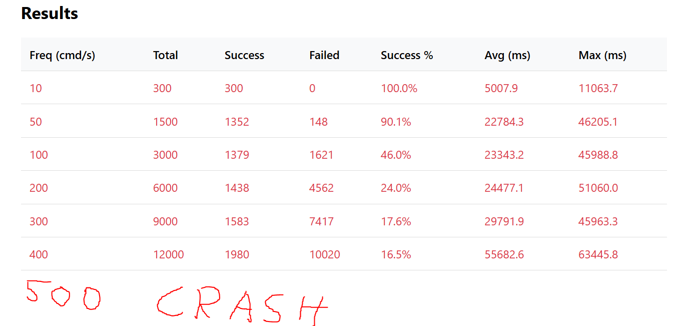
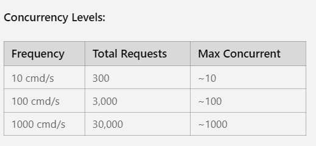
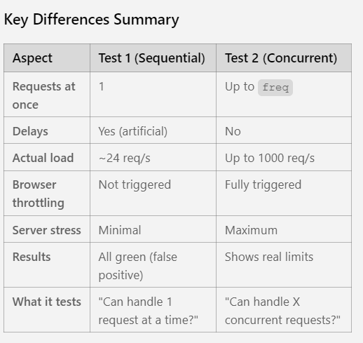

# ESP32 Overload and Stability Test

## Overview
This is an **ESP32 Overload and Stability Test** designed to find the practical limits of the system under intensive use to ensure stability and graceful degradation through the web interface.

Below is a step-by-step guide on how to perform this test.

---

## 1. Preparation and Setup

### 1.1 Define the Test Environment
- Ensure you have a working **ESP32 development board** (M5Stack Atom Lite) and a connected LED that can be controlled by commands
- Verify that the ESP32 is running API code that supports:
  - **SET** (color setting) commands
  - **GET** (state query) commands (likely over HTTP)

### 1.2 Create the Testing Tool
- You will need a script (e.g., Python, C++, etc.) capable of:
  - Sending repeated and rapid HTTP POST/PUT (SET) requests to the ESP32
  - Measuring the results and timing of those requests
  - **Note:** I will use Arduino IDE and `.ino` file for that
- The script must be able to:
  - Generate **random RGB values** for each SET command
  - Send **HTTP GET requests** to check the device's current state

### 1.3 Set Up Monitoring
- The script must measure the **response time (latency)** for every HTTP SET response
- If possible, set up internal logging on the ESP32 (e.g., via serial) to see if and when the device starts:
  - Dropping commands
  - Generating internal errors

---

## 2. Escalating Load Test (Stress Test)

**Goal:** Find the critical point where the ESP32 begins to behave erratically.

### 2.1 Baseline (10 commands/s)
- Run the testing script, sending **10 SET commands per second** with random RGB values
- **Monitor:**
  - **HTTP Response Times:** Check if they are fast, e.g., below 100ms
  - **LED Behavior:** Check if colors change instantly and correctly

### 2.2 Gradual Load Increase
- Increase the command sending frequency gradually (e.g., in increments of 5-10 commands/s):
  - **10 → 15 → 20 → 30 → 40 ... up to 100+ commands per second**
- At each load level (e.g., in **30-second intervals**), perform the following steps:
  - **Measure and Log:** Continue logging the response times for all SET commands
  - **Identify Slow/Failed Responses:** Note the first level where response times become slow (>500ms) or where responses fail to arrive completely (timeout)
  - **Check for Dropped Commands (GET Verification):** After each burst of SET commands, send one or more GET commands (state query) to check the LED's current value
  - **Compare:** Compare the value of the last SET command sent with the value returned by the GET command
  - **Result:** If these values do not match, the system has started dropping commands. Log this load level.

### 2.3 Identify the Critical Point
- Continue increasing the load until the system:
  - Completely **crashes** (stops responding to HTTP requests entirely), OR
  - Command dropping becomes the dominant problem
- This is the **critical instability point**

---

## 3. Recovery Test

**Goal:** Verify whether the system can automatically recover from an overload.

### 3.1 Induce Overload
- Push the ESP32 slightly above the critical point found in the previous test, so the device is clearly overloaded or "hung"
- **Note (log)** the color of the last SET command before the recovery test begins

### 3.2 Stop the Load
- Immediately **stop sending all SET commands** using the testing script

### 3.3 Measure Recovery Time
- Continue sending regular **GET requests** (e.g., once per second) to the device
- Measure the time from when command sending stopped until the device starts responding normally to the API (response time <100ms or another normal time)
- This is the **recovery time**

### 3.4 Verify State Persistence
- After the system recovers, check the actual LED color
- Perform a GET request and verify that the value returned by the device matches the color of the last SET command sent
- This confirms that the system **maintained its state** even during the overload

---

## 4. Practical Value Analysis and Results

### 4.1 Compile the Results
- **Maximum Stable Command Frequency:** The highest number of commands per second where response times were acceptable (e.g., <200ms) and no commands were dropped (GET verification was successful). This is the number the web interface must account for.
- **Graceful Degradation Limit:** The load level where response times became slow (e.g., >500ms) but the device was still working (i.e., not crashed)
- **Critical Failure Limit:** The load level where the system began dropping commands or crashed
- **Recovery Time:** The time taken to return to a normal state after the overload ceased

### 4.2 Provide Practical Value (Throttling Recommendations)
- The results are used to set the logic for the web interface's **Throttling** (command limitation)
- **Example:** If the maximum stable frequency is 35 commands per second, the web interface should be designed to send a maximum of 30-35 commands per second when the user drags the color wheel, to prevent stability issues

---

## Summary

This test will help determine:
- Maximum safe operating frequency
- System behavior under stress
- Recovery capabilities
- Optimal throttling settings for the web interface

---

## 5. Implementation Options for Overload and Stability Test

Based on the requirements and reference files, here are the approaches we can take:

### **Option 1: Self-Contained Test (Recommended)**
**M5 Atom Lite tests itself without external dependencies**

**How it works:**
- The M5 Atom runs both the **web server** (from `WebServer_WifiSetup.ino`) AND the **test client** code
- Uses a timer/loop to generate HTTP requests internally to itself (localhost/127.0.0.1)
- Measures response times, tracks dropped commands, logs results via Serial

**Pros:**
- ✅ No external computer needed
- ✅ Self-contained, portable test
- ✅ Similar structure to `Test1-LedColorChange.ino` (user-friendly)
- ✅ Easy to run and repeat

**Cons:**
- ❌ Testing the device with itself may not reflect real-world network conditions
- ❌ Limited by single-core processing (server + client compete for resources)

---

### **Option 2: Two M5 Devices (Client-Server)**
**One M5 runs the server, another runs the test client**

**How it works:**
- **Device 1:** Runs the web server (modified `WebServer_WifiSetup.ino`)
- **Device 2:** Runs the test client that sends HTTP requests to Device 1's IP
- Client measures response times and logs results

**Pros:**
- ✅ More realistic network testing
- ✅ Separates server and client workloads
- ✅ Better stress testing

**Cons:**
- ❌ Requires 2 M5 Atom devices
- ❌ More complex setup

---

### **Option 3: Python Script on Computer**
**External Python script sends requests to M5 Atom**

**How it works:**
- M5 Atom runs the web server
- Python script on your computer sends HTTP requests at varying frequencies
- Script logs response times, dropped commands, etc.

**Pros:**
- ✅ Most realistic real-world scenario
- ✅ Powerful logging and analysis capabilities
- ✅ Easy to adjust test parameters

**Cons:**
- ❌ Requires Python setup on computer
- ❌ Not self-contained in Arduino IDE
- ❌ You mentioned preferring `.ino` files

---

### **Option 4: Hybrid Approach**
**M5 Atom runs server + basic client, with optional external monitoring**

**How it works:**
- M5 Atom runs web server and internal test client
- Optionally, you can also monitor via external tools (browser, Python script)
- Best of both worlds

**Pros:**
- ✅ Flexible
- ✅ Can run standalone or with external monitoring
- ✅ Good for iterative testing

**Cons:**
- ❌ More complex code

---

### **Recommended Implementation: Option 1**

**Rationale:**
1. Matches the `Test1-LedColorChange.ino` pattern (interactive, serial-based)
2. Uses Arduino IDE and `.ino` files exclusively
3. Easy to run, repeat, and share
4. For M5 Atom Lite, the goal is to find practical limits for web interface throttling

**Implementation Plan:**
1. **Base code:** Use `WebServer_WifiSetup.ino` as the web server foundation
2. **Add GET endpoint:** Implement `/get` to return current LED color
3. **Add test mode:** When button is pressed (or serial command), enter test mode:
   - Automatically send SET requests at increasing frequencies
   - Measure response times
   - Verify with GET requests
   - Log results to Serial Monitor
4. **User interaction:** Similar to Test1, ask user to confirm observations at each load level

---

## 6. Final Implementation: Browser-Based Testing

We implemented **browser-based HTTP testing** using JavaScript. The M5 Atom runs a web server with a `/test` endpoint that provides an interactive testing interface.

### **Two Testing Approaches Available**

We have implemented **two versions** of the test to demonstrate different testing methodologies:

---

## 7. Test Approach Comparison

### **Approach 1: Sequential with Delays** 📁 `Sequential/`



#### **How It Works:**
```javascript
const delay = 1000/freq;  // Calculate delay between requests
while(Date.now() - startTime < testDuration) {
  const result = await sendSetRequest(color);  // Send ONE request
  // Process result...
  await new Promise(r => setTimeout(r, delay));  // WAIT before next request
}
```

#### **Behavior:**
- **Sequential execution**: Sends one request, waits for response, then sends next
- **Artificial delays**: Adds `setTimeout(delay)` between each request
- **Example at 1000 cmd/s**:
  - Target: 1 request every 1ms (1000/sec)
  - Reality: 1 request → wait ~40ms for response → wait 1ms delay → next request
  - **Actual rate**: ~24 requests/second (not 1000!)

#### **Why Results Are "Too Good":**
- Browser is **never stressed** - only 1 request at a time
- M5 Atom is **never stressed** - has 40ms+ to process each request
- The test measures "can the server handle 24 requests/second?" (YES)
- Not measuring "can it handle 1000 requests/second?" (UNKNOWN)

#### **Use Case:**
- Good for **baseline testing**
- Verifies basic functionality
- Shows minimum response times under no load

---

### **Approach 2: Concurrent Without Delays** 📁 `Concurrent/`



#### **How It Works:**
```javascript
const targetRequests = freq * testDuration / 1000;  // Total requests needed
const promises = [];

for(let i = 0; i < targetRequests; i++) {
  const promise = sendSetRequest(color);  // Start request (don't wait!)
  promises.push(promise);
  
  if(promises.length >= freq) {
    await Promise.race(promises);  // Wait for ANY one to finish
  }
}
await Promise.all(promises);  // Wait for all to complete
```

#### **Behavior:**
- **Concurrent execution**: Sends multiple requests simultaneously
- **No artificial delays**: Requests fire as fast as possible
- **Example at 1000 cmd/s**:
  - Starts up to 1000 requests concurrently
  - Maintains high concurrency throughout test
  - Total: 30,000 requests over 30 seconds

#### **Concurrency Levels:**



| Frequency | Total Requests | Max Concurrent |
|-----------|---------------|----------------|
| 10 cmd/s  | 300           | ~10            |
| 100 cmd/s | 3,000         | ~100           |
| 1000 cmd/s| 30,000        | ~1000          |

#### **Why This Stresses The System:**
1. **Network stack overload**: Many simultaneous HTTP connections
2. **Memory pressure**: Each connection uses RAM on M5 Atom
3. **Processing queue**: Server must handle many requests in parallel
4. **WiFi congestion**: Radio can't handle that many concurrent transmissions

#### **Use Case:**
- **Real stress testing**
- Finds actual performance limits
- Shows system behavior under load
- Reveals breaking points

---

## 8. Key Differences Summary



| Aspect | Sequential (Approach 1) | Concurrent (Approach 2) |
|--------|------------------------|------------------------|
| **Requests at once** | 1 | Up to `freq` |
| **Delays** | Yes (artificial) | No |
| **Actual load** | ~24 req/s | Up to 1000 req/s |
| **Browser throttling** | Not triggered | Fully triggered |
| **Server stress** | Minimal | Maximum |
| **Results** | All green (false positive) | Shows real limits |
| **What it tests** | "Can handle 1 request at a time?" | "Can handle X concurrent requests?" |

### **Why Sequential Failed to Find Limits:**

The formula `delay = 1000/freq` assumed:
- Request time = 0ms (instant)
- Only delay matters

But reality:
- Request time = ~40ms (network + processing)
- Delay = 1ms (at 1000 cmd/s)
- **Total time per request = 41ms**
- **Actual frequency = 1000/41 ≈ 24 requests/second**

So even at "1000 cmd/s" setting, you were only achieving **24 requests/second** - well within the M5 Atom's capabilities!

### **Analogy:**

**Sequential Test** = Testing if a restaurant can handle customers by sending one person, waiting for them to finish their meal, then sending the next person. (Easy!)

**Concurrent Test** = Testing if a restaurant can handle customers by sending 1000 people at once and seeing what happens. (Chaos!)

The concurrent test reveals the **real capacity limits**.

---

## 9. Implementation Details

### **Common Features (Both Versions)**

#### **Web Server**
- **`/get`** endpoint - Returns current LED color as JSON
- **`/set?color=%23RRGGBB`** endpoint - Sets LED color
- **`/test`** endpoint - Browser-based test interface
- Runs on WiFi AP: `M5Stack_Test` / `12345678` at `192.168.4.1`

#### **Test Configuration**
- **12 frequency levels**: 10, 50, 100, 200, 300, 400, 500, 600, 700, 800, 900, 1000 cmd/s
- **30 seconds** per frequency level
- **~6 minutes** total test duration

#### **Metrics Tracked**
- ✅ Total requests sent
- ✅ Successful/failed requests
- ✅ Response times (min/avg/max)
- ✅ Success rate percentage

#### **Final Report Includes**
- **Maximum Stable Frequency** (>95% success, <200ms avg)
- **Graceful Degradation Point** (>80% success, <500ms avg)
- **Critical Failure Point** (<50% success)
- **Throttling recommendation** for web interface

---

## 10. How to Use

### **Setup:**
1. **Choose version**: Sequential or Concurrent
2. **Upload** the code to your M5 Atom Lite
3. **Connect** to WiFi: `M5Stack_Test` / `12345678`
4. **Open browser**: `http://192.168.4.1`

### **Running the Test:**
1. Click **"Launch Overload Test"**
2. Click **"Start Test"** button
3. Watch real-time progress
4. Wait for test completion (~6 minutes)
5. View color-coded results table
6. Read throttling recommendation

### **Understanding Results:**

- 🟢 **Green rows**: Good performance (>95% success, <200ms avg)
- 🟡 **Yellow rows**: Warning (>80% success, <500ms avg)
- 🔴 **Red rows**: Poor performance (<80% success or >500ms avg)

---

## 11. Files Structure

```
Test2-OverLoadandStability/
├── Sequential/
│   └── Test2-OverLoadandStability-Seq.ino    # Sequential with delays
├── Concurrent/
│   └── Test2-OverLoadandStability-Con.ino    # Concurrent without delays
├── img/
│   ├── OverLaodTest-Sequential.jpg           # Sequential results
│   ├── OverLaodTest-Sequential_2.jpg         # Sequential results detail
│   ├── OverLaodTest-Conqurrent.PNG           # Concurrent results
│   ├── Concurrency_levels.PNG                # Concurrency explanation
│   └── KeyDifferencesSummary.PNG             # Comparison table
└── README/
    └── README.md                              # This file
```

---

## 12. Recommendations

### **For Learning/Demonstration:**
- Use **both versions** to understand the difference
- Start with Sequential to see baseline performance
- Then run Concurrent to find real limits

### **For Production Testing:**
- Use **Concurrent version** for realistic results
- Set web interface throttling based on Concurrent test results
- Consider safety margin (e.g., if max is 400 cmd/s, throttle at 300 cmd/s)

### **For Web Interface:**
- Implement throttling based on test results
- Add visual feedback when throttling is active
- Consider adaptive throttling based on response times
