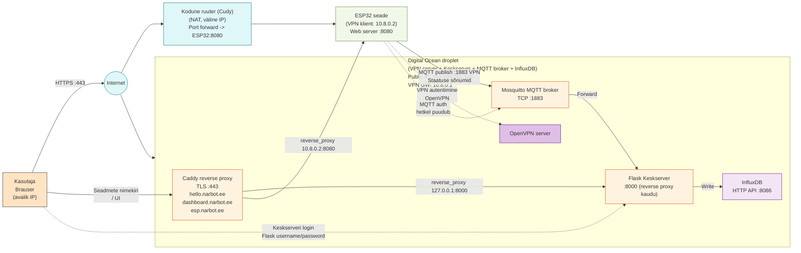
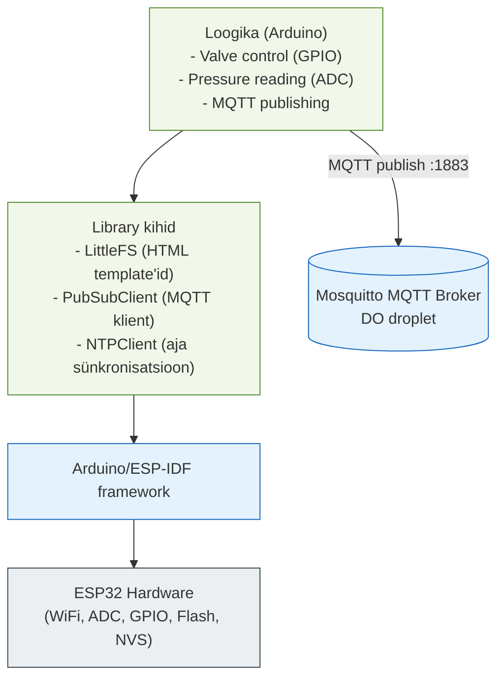
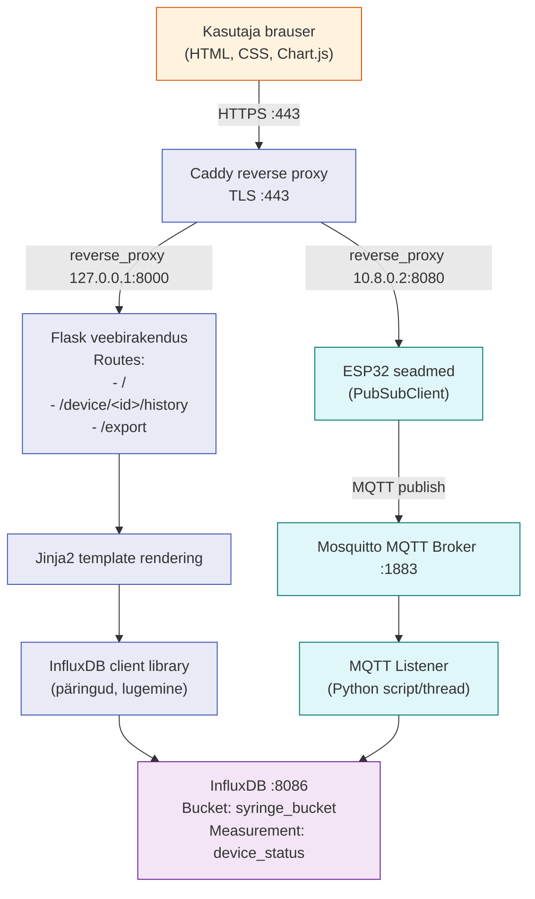
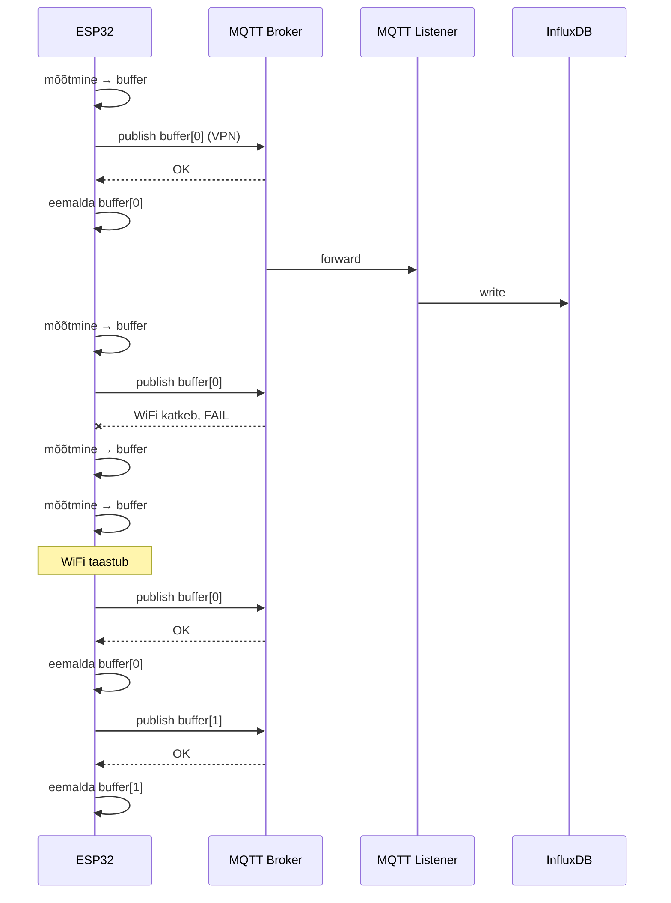
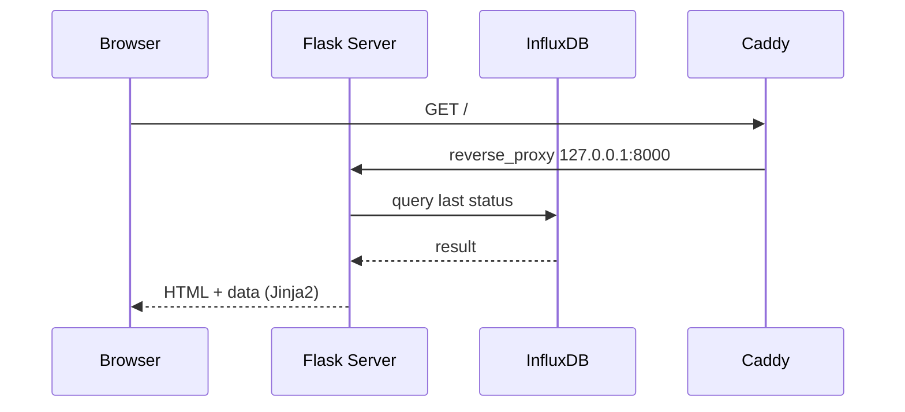
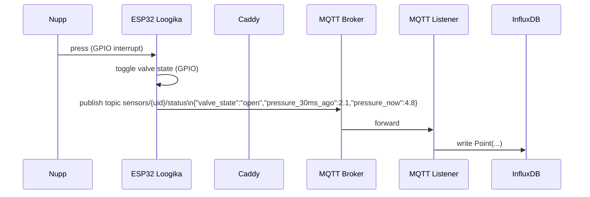

# Arhitektuur

See dokument sisaldab süsteemi arhitektuuri jooniseid MermaidJS formaadis (soovitatav renderdada GitHubis või Mermaid Live Editoris).

## Infrastruktuuri diagramm

## Software stack diagramm

### ESP32 stack

### Keskserveri stack

## Suhtlus (sequence diagrammid)

### Stsenaarium 1: ESP32 saadab staatust

### Stsenaarium 2: Kasutaja vaatab seadmete nimekirja

### Stsenaarium 3: Kasutaja juhib ESP32 klappi

## Tehnoloogiate legend

- OpenVPN: VPN protokoll (UDP/TCP)
- MQTT: Message broker protokoll (TCP, port 1883)
- MQTT autentimine: hetkel puudub
- Mosquitto: MQTT broker tarkvara
- InfluxDB: Time-series andmebaas (HTTP API, port 8086)
- Caddy: Reverse proxy + TLS terminatsioon (HTTPS :443)
- Flask: Python web framework
- Jinja2: Template rendering (Flask sees)
- NTP: Network Time Protocol (aja sünkronisatsioon)
- LittleFS: ESP32 failisüsteem
- NVS: ESP32 non-volatile storage (WiFi kredentsiaalid)
- PubSubClient: Arduino MQTT kliendi library
- Chart.js: JavaScript graafikute teek

## Miks need diagrammid on olulised

Need diagrammid dokumenteerivad süsteemi arhitektuuri viisil, mida on võimalik:

- Näidata, et sa mõistad kogu süsteemi terviklikult
- Kasutada ise tulevikus kui pead süsteemi uuesti üles seadma
- Jagada teiste tudengitega, et nad saaksid sinu lahendusest õppida
- Kasutada alusena kui tahad süsteemi laiendada (nt lisada uusi sensoreid)

Diagrammid peaksid olema piisavalt detailsed, et keegi teine saaks nende põhjal süsteemi üles ehitada, kuid mitte nii detailsed, et muutuvad loetamatuks. Kasuta värve, et eristada erinevaid komponente ja andmevooge.
